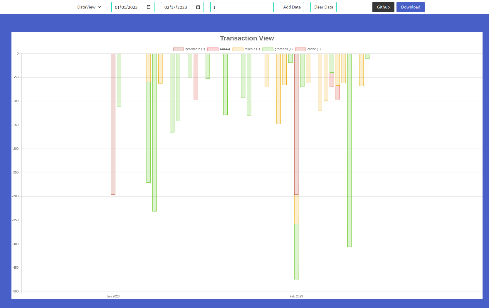
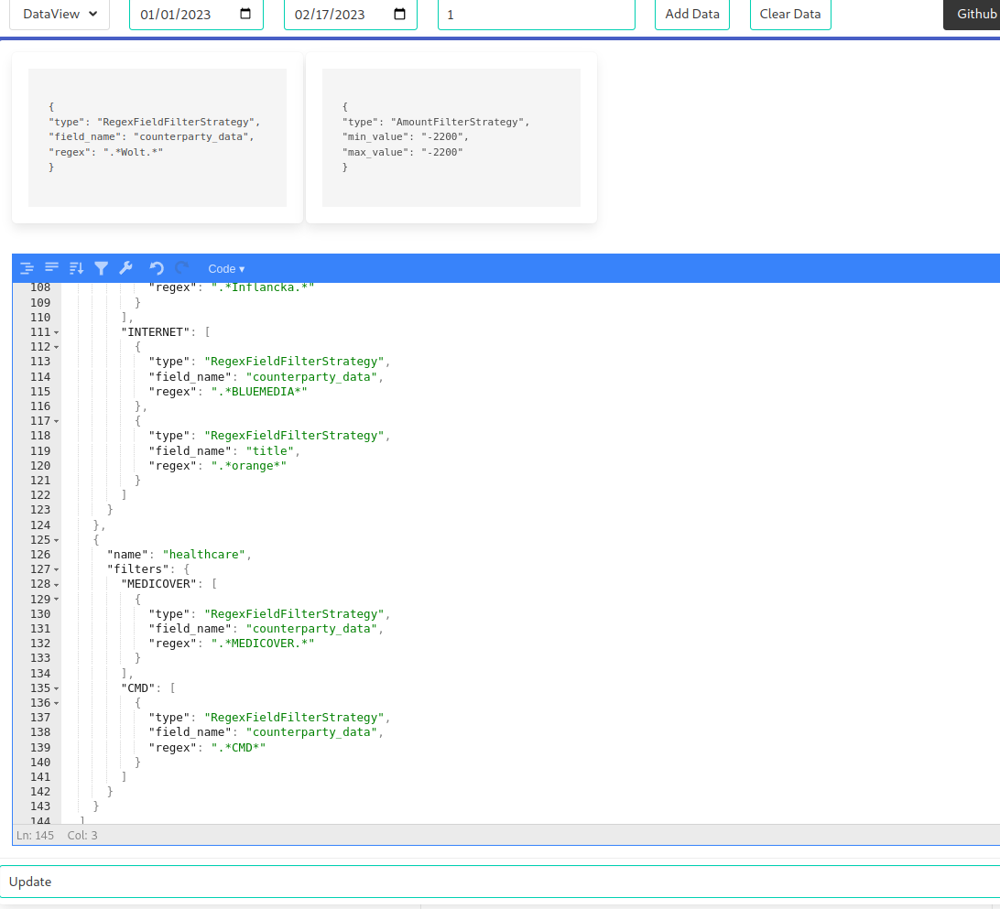

# PYFI

## Projects

### pyfi_core
 - Common classes for building transactionviews using transactions, filter rules, and transform rules. 

### pyfi_server
 - Sample app using flask and charts.js. 
 - Requires `datasource.json` and `views.json` config files under `/srv/pyfi/etc/`.

||datasource.json|views.json|
|---|---|---|
|Description|Configuration for transaction data sources.|Configuration for transaction views.|
|Example| [LINK](docs/datasource.md) | [LINK](docs/views.md) |


## Usage:

``` python

## Setup
transaction = <[transaction]>
start_date = <datetime>
end_date = <datetime>
time_delta_d = <int>
transaction_view_filters = [
    RegexFieldFilterStrategy('counterpart_data', ".*UBER.*")
]

# exchange rate provider to normalize amounts to a common currency
# linear fit works best with free api access
exchange_rate_provider = LinearFitOpenExchangeRatesProvider(
    date(2021, 1, 1),
    date(2023, 2, 1),
    timedelta(days=60)
)
transaction_transform_currency = CurrencyTranformStrategy("PLN", exchange_rate_provider)

## Extract View
transaction_view_builder = TransactionViewBuilder(transactions)
transaction_view_builder.set_duration(start_date, end_date, timedelta(days=time_delta_d))
transaction_view_builder.add_transform(transaction_transform_currency)
transaction_view_builder.add_filters(transaction_view_filters)
transaction_view_builder_views = transaction_view_builder.get_views()
```

## Web Interface

### Chart and controls.


### Dataview Editor.



## Progress

### pyfi_core - Exchange Rates

- [x] Hardcoded implementation
- [x] OpenExchangeRatesProvider (high resulution, api calls grow with data, duplicate calls if same data requested)
- [x] CachedOpenExchangeRatesProvider (high resulution, api calls grow with data up to data resolution)
- [x] LinearFitOpenExchangeRatesProvider (low resolution, api calls fixed to resolution requested using start_date, end_date, timedelta(days))
- [ ] UnitTests

### pyfi_core - DataSource

- [x] ING CSV
- [ ] UnitTests
- [ ] Import/Export to pyfi native datastore
- [ ] ??

### Frontend

- [x] Chart.js Bars
- [x] UI Labels for Inputs
- [x] Stacked Bar
- [ ] Cleanup Html